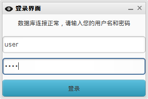

#学生信息管理系统

##预览
这是一款可以查询山西农业大学软件学院学生信息的PC软件，使用java构建，然而安卓版只是写UI，移植一下就可以了。基础用户只能查到性别、班级等信息，而高级用户开放了所有接口。并且有测试用户，测试用户有限额的查询次数。

此处应该有图片。

##功能

 + 可以查询学生的基本信息。
 + 增删改查学生信息。

##发布及部分思路
因为java的跨平台性，实际上QT更适合写跨平台应用，然而老师却是要java版本，因为java原生UI比较难看，并且效率低，在找寻合适UI的同时，为了避免重复造轮子，采用了[beautyeye](https://github.com/JackJiang2011/beautyeye)框架。

在加密部分涉及到了非对称加密，利用一种RSA算法，非对称密钥。在帐号限制方面，采用了部分注册软件设计的思路，并且加了压缩壳，在最新版360、百度杀毒、腾讯电脑管家下测试通过。

然而现在觉得MySql在没有做任何安全措施的情况下，是毫无安全性可言的。因此需要做好安全服务，应避免root用户操作。

源码部分在[Github](https://github.com/DigDream/SIMS)上，可执行文件会逐步打包。

可以使用git clone命令下载源码。

	git clone https://github.com/DigDream/SIMS.git

~~也可通过launchpad直接下载~~

	//brunch

##安装及使用

双击可执行文件，或者根据源码进行编译。

编辑.properties文件，将数据库连接信息填入文件。

数据库名为：sxaustudents，可自行更改。

数据库表段：

	SET SQL_MODE = "NO_AUTO_VALUE_ON_ZERO";
	SET time_zone = "+00:00";
	CREATE DATABASE IF NOT EXISTS `sxaustudents` DEFAULT CHARACTER SET utf8 COLLATE utf8_general_ci;
	USE `sxaustudents`;
	
	CREATE TABLE IF NOT EXISTS `software` (
	`id` bigint(20) NOT NULL,
	  `collage` varchar(25) DEFAULT NULL,
	  `grade` varchar(10) DEFAULT NULL,
	  `class` varchar(10) DEFAULT NULL,
	  `student_id` varchar(12) DEFAULT NULL,
	  `name` varchar(12) DEFAULT NULL,
	  `sex` varchar(5) DEFAULT NULL,
	  `nation` varchar(7) DEFAULT NULL,
	  `phone` varchar(12) DEFAULT NULL,
	  `dorm` varchar(8) DEFAULT NULL,
	  `politics` varchar(12) DEFAULT NULL,
	  `identity_id` varchar(21) DEFAULT NULL,
	  `home_phone` varchar(36) DEFAULT NULL,
	  `zip` varchar(10) DEFAULT NULL,
	  `address` varchar(90) DEFAULT NULL,
	  `native_palce` varchar(59) DEFAULT NULL,
	  `family_backgrond` varchar(250) DEFAULT NULL,
	  `reward` varchar(250) DEFAULT NULL,
	  `other` varchar(250) DEFAULT NULL,
	  `duty` varchar(25) NOT NULL
	) ENGINE=MyISAM AUTO_INCREMENT=1103 DEFAULT CHARSET=utf8;
	
	CREATE TABLE IF NOT EXISTS `user_table` (
	`id` bigint(20) NOT NULL,
	  `user` varchar(20) NOT NULL,
	  `pw` varchar(50) NOT NULL,
	  `name` varchar(20) NOT NULL,
	  `phone` varchar(20) NOT NULL
	) ENGINE=MyISAM AUTO_INCREMENT=913 DEFAULT CHARSET=utf8;
	
	INSERT INTO `user_table` (`id`, `user`, `pw`, `name`, `phone`) VALUES
	(912, 'test', 'test', 'test', '188888');
	
	
	ALTER TABLE `software`
	 ADD PRIMARY KEY (`id`);
	
	ALTER TABLE `user_table`
	 ADD KEY `id` (`id`);
	
	
	ALTER TABLE `software`
	MODIFY `id` bigint(20) NOT NULL AUTO_INCREMENT,AUTO_INCREMENT=1103;
	ALTER TABLE `user_table`
	MODIFY `id` bigint(20) NOT NULL AUTO_INCREMENT,AUTO_INCREMENT=913;

双击之后，填写数据库连接信息后，会弹出帐号登录的对话框，测试帐号为test，密码为test。

##协议

本作品依照GPL v3协议，可自由修改版权，并且欢迎在[Github](https://github.com/DigDream/SIMS)上提issue。但是初始化的数据不对外提供，请联系本人或者学院。

##部分设计文档

[DesignDoc](https://github.com/DigDream/SIMS/blob/master/DesignDoc.md)

[AdvancedDoc](https://github.com/DigDream/SIMS/blob/master/AdvancedDoc.md)

[LearnDoc](https://github.com/DigDream/SIMS/blob/master/LearnDoc.md)

##致谢

+ beautyeye框架
+ chromebook
+ Java Development Kit
+ mysql-connecter
+ sqlite

##TODO

1.写关于java的RBAC的个人实践。

2.分权限控制用户进行操作(RBAC)。

##关键词

JAVA MVC DAO SINGLETON JDBC MYSQL INTERFACES

##后记

一支穿云箭，千军万马来相见。

在无感之夜，流离。

最初，枉想，然氛围。

缺开放，交流。

希激励，却应付。

实不利，然无他。

青春梦，即以死。

遂实现，高耦合。

虽已知，应重文档。

贵抄袭，实无利。

难有调试，却性能之困。

少浮躁，难静心。

积跬步，向底层。

勤思考，寻经验。

忌本末，莫倒置。

##另微信公众帐号可以方便地实现需求

虽然最后还是应付了事，但是最后总结几篇文章吧。